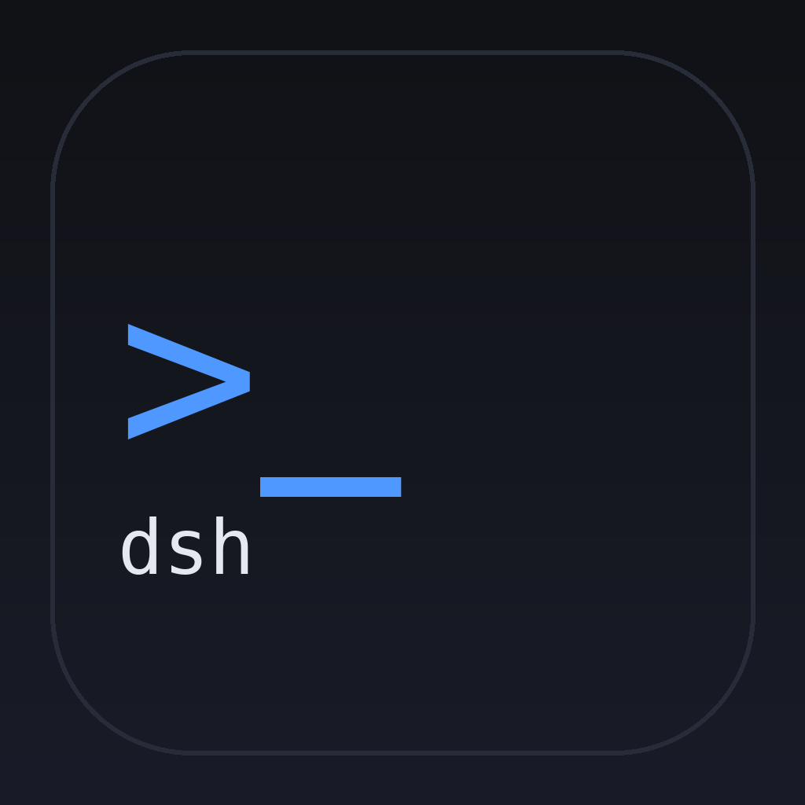
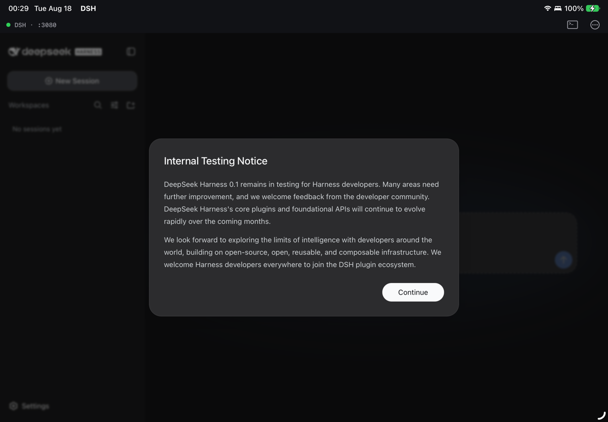
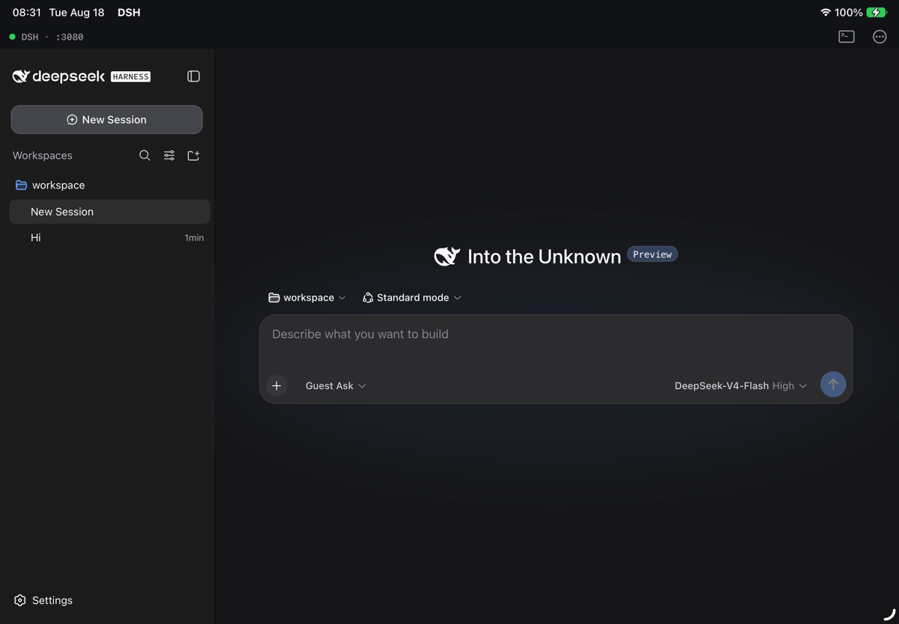
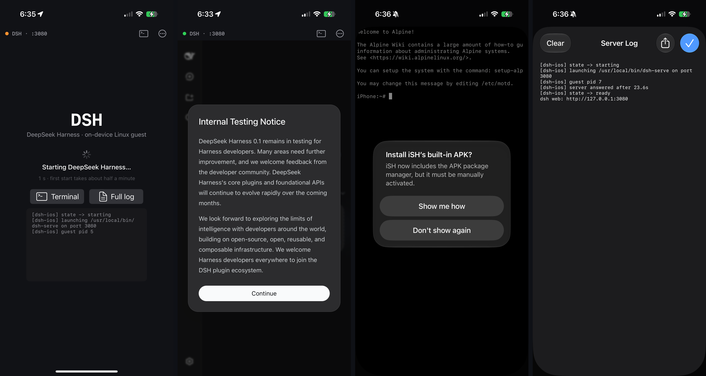
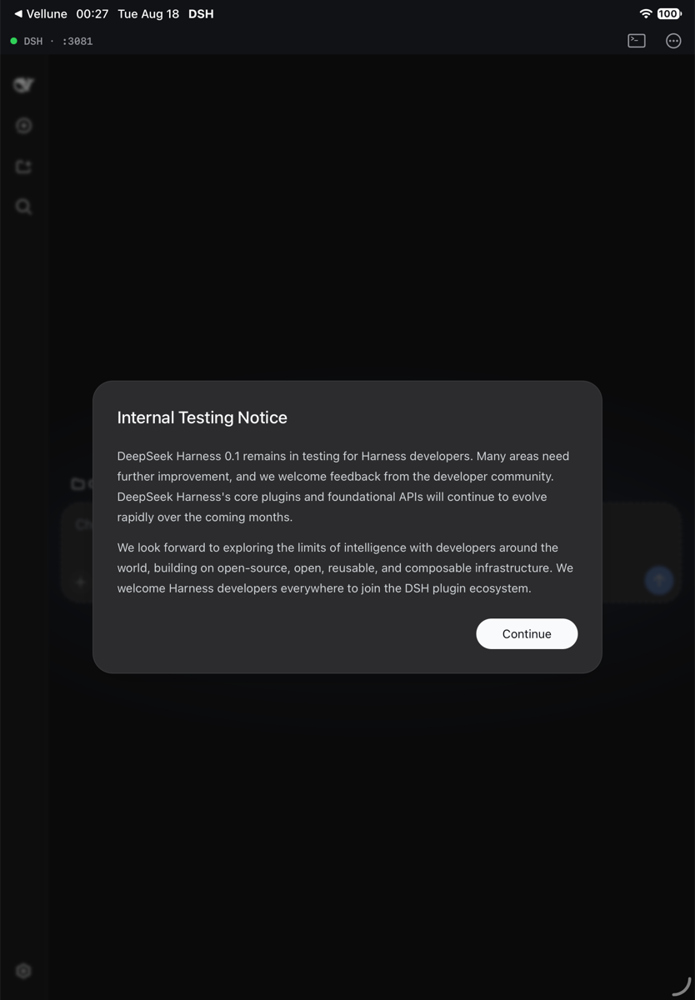

<h1 align="center">
  <br>
  DSH — DeepSeek Harness on iPad &amp; iPhone
</h1>

<p align="center">
  <b>Run <a href="https://github.com/deepseek-ai/deepseek-harness">DeepSeek Harness</a> (<code>dsh</code>) entirely on your iPad or iPhone — no jailbreak, no server, no Mac in the loop.</b>
</p>

<p align="center">
  <a href="https://xnu.app/dsh-ios/">Project page</a> ·
  <a href="README.zh.md">中文说明</a> ·
  <a href="#quick-start">Quick start</a> ·
  <a href="#how-it-works">How it works</a> ·
  <a href="#tests">Tests</a> ·
  <a href="#faq">FAQ</a>
</p>

<p align="center">
  
  
  
  <a href="LICENSE"></a>
</p>

DSH is a native iOS app that embeds the [iSH-ARM64](ish-arm64) userspace Linux
emulator, boots a bundled Alpine Linux image with Node.js 22 and
`@deepseek-ai/dsh`, supervises `dsh web`, and shows the harness's own web UI in
a `WKWebView`. The agent loop, sessions, tools and the shell all run on the
device; only the model API calls leave it.

| Real iPad Air (M3, iPadOS 27) — first launch | Sessions & workspace |
|---|---|
|  |  |

<sub>Left: the guest has booted and DeepSeek Harness is served on
127.0.0.1:3080 (green dot in the DSH bar). Right: a workspace with sessions —
model picker, the “Guest Ask” permission preset and everything else is the
stock dsh web UI.</sub>

<details>
<summary>iPhone 17 Pro: startup overlay, UI, terminal, server log</summary>
<p align="center"></p>
</details>

<details>
<summary>Also runs on the Apple Silicon iPad simulator</summary>
<p align="center"></p>
</details>

## Features

- **Fully on-device** — Alpine 3.21 (aarch64) + Node 22 + dsh 0.1 inside the
  app; works offline except for the model API.
- **The real harness UI** — dsh's own web app served on loopback: sessions,
  workspaces, tools, permission presets, settings.
- **A shell when you want one** — `>_` in the DSH bar opens an Alpine terminal
  in the same guest (`apk add`, `npm i -g`, look at `~/.dsh`); the `⋯` menu has
  Reload, Server Log, Restart Harness, Open in Safari, About.
- **Supervised server** — free-port selection, HTTP readiness probe, crash
  restart with back-off, health check when the app returns to the foreground,
  live log tail on the startup overlay.
- **Safe updates** — a new guest image shipped with an app update is imported
  as a fresh root; `~/.dsh` (sessions, credentials, settings) and the workspace
  are migrated automatically.
- **Real LLM streaming under emulation** — Node runs jitless (no WebAssembly),
  so DSH ships a `fetch()` polyfill with proper streaming `Response` bodies;
  the SSE round trip is covered by a test against a mock DeepSeek server.
- **Downloads & files** — session-log exports land in *Files ▸ DSH ▸ Downloads*.
- Keyboard: ⌘R reload, ⇧⌘T terminal. iPad first; iPhone works too, portrait and landscape.

## Quick start

**Prerequisites:** macOS on Apple Silicon, Xcode 26/27, `brew install meson ninja lld`
(`ld.lld` builds the guest VDSO; without it the guest cannot run),
Node.js ≥ 20 + npm, the `xcodeproj` Ruby gem (`gem install xcodeproj`, or
CocoaPods), an Apple developer team for device signing.

Because the app reads Apple Health, it needs the `com.apple.developer.healthkit`
entitlement, which the team *wildcard* profile does not carry: on your first
device build, open Signing & Capabilities, pick your team, and let Xcode create
an explicit App ID for the bundle id. (If you would rather not, remove the
`HealthKit` capability and `app/DSH.entitlements` — everything else works
without it.)

```bash
git clone https://github.com/everettjf/dsh-ios.git && cd dsh-ios
make emulator        # iSH-ARM64 CLI + fakefsify (used to build and test the guest image)
make rootfs          # build/root.tar.gz — Alpine + Node 22 + dsh (~95 MB, ~6 min, needs network)
open DSH.xcodeproj   # DSH scheme → your iPad → set the team → Run
```

Or from the command line:

```bash
make run TEAM=XXXXXXXXXX DEVICE=<udid>   # build, sign, install, launch on the iPad
```

First launch imports the guest image (~30 s, progress on the overlay); later
launches take a few seconds. When the harness asks for a DeepSeek API key,
paste it or tap *Configure later*; keys are stored by dsh inside the guest
(`/root/.dsh`), never by the app.

## How it works

```
┌─ DSH.app ────────────────────────────────────────────────────────┐
│  DSHRootViewController ──► WKWebView ──► http://127.0.0.1:3080    │
│         │                                        ▲                │
│  DSHHarness  (port pick · readiness probe · restart · health)     │
│         │  ISHShellExecutor                      │ loopback       │
│  ┌──────▼──── iSH-ARM64 emulator (Alpine 3.21 aarch64) ───────┐   │
│  │  /usr/local/bin/dsh-serve                                  │   │
│  │    → node --expose-internals @deepseek-ai/dsh web          │   │
│  │        --host 127.0.0.1 --port N  ─────────────────────────┘   │
│  └────────────────────────────────────────────────────────────┘   │
└──────────────────────────────────────────────────────────────────┘
```

- **Emulator.** iSH-ARM64 is a userspace Linux emulator (Asbestos threaded-code
  interpreter with an AArch64 guest backend). The guest's sockets are
  pass-through host sockets, so the loopback port dsh listens on is reachable
  from the app's web view (and Safari).
- **Guest image.** `scripts/build-rootfs.sh` builds `root.tar.gz` **on the Mac
  inside the same emulator**: Alpine minirootfs → `apk add nodejs npm …` → the
  pinned npm tree from `rootfs/staging` (installed on the host for
  linux/arm64/musl) → `node-pty` rebuilt for musl → overlay → exported with
  `unfakefsify`. `rootfs/overlay` holds the entry point `dsh-serve`, the guest
  self test, and `cordis.patch.yml` — the dsh profile layer that turns off the
  per-command sandbox (the whole guest already *is* the sandbox) and defines
  the `guest-ask` permission preset.
- **Supervisor.** `DSHHarness` picks a free loopback port, launches `dsh-serve`
  through `ISHShellExecutor`, polls until HTTP answers, restarts on crashes and
  publishes state to the UI. `DSHRootUpgrader` compares the bundled image's
  SHA-256 with the imported root on every launch and migrates user data when it
  changes.

### Changes made to the emulator (`ish-arm64`, vendored fork of OpenMinis/ish-arm64)

| Change | Why |
|---|---|
| `FCVTL/FCVTL2`, `FCVTN/FCVTN2`, `FCVTXN/FCVTXN2` and vector fixed-point `SCVTF/UCVTF/FCVTZS/FCVTZU #fbits` gadgets | libvips (used by `sharp`, dsh's image-attachment plugin) traps on them |
| `FMOV (scalar, immediate)` decoder fix | imm8 bit 6 was not inverted for constants such as `2.25` or `31.0` — every guest program computed wrong values |
| `waitpid()` no longer returns `EINTR` when its 1 s bounded wait merely times out | broke gcc/g++ (`failed to get exit status`), node-gyp, anything waiting on a child > 1 s |
| Streaming `fetch()` polyfill (`app/RootfsPatch.bundle`) returning real `Response` objects | LLM streaming (SSE) via undici needs WebAssembly, which jitless V8 lacks |
| `ISHShellExecutor` returns shell exit codes and drains pipes after exit; `ContainerURL()` falls back without an app group; deployment target 15.0 | app integration |

The vendored copy records its upstream commit in [`ish-arm64/UPSTREAM.md`](ish-arm64/UPSTREAM.md); the fixes are self-contained and welcome upstream.

## Tests

```bash
make test               # unattended on this Mac: emulator + rootfs + XCTest/XCUITest on the simulator
make test-device-unit   # unit + guest-integration tests on the connected iPad
make test-device        # + UI tests on the iPad (enable Settings ▸ Developer ▸ UI Automation first)
```

| Suite | Covers | Runs on |
|---|---|---|
| `tests/emu-test.sh` | the new NEON gadgets and the FMOV fix (C test compiled with gcc *inside* the guest), the `waitpid` regression, the fetch polyfill (host node, 11 checks) | macOS |
| `tests/rootfs-test.sh` | imports `root.tar.gz` like the app does, guest self test (node-pty/koffi/ripgrep/sharp), profile patch, **headless LLM round trip through a mock DeepSeek SSE server**, every bridge tool driven through a real agent turn against a stub bridge, `dsh-serve` reachable over loopback | macOS |
| `DSHTests` (XCTest, hosted in the app) | port allocator, log ring, readiness probe, harness state machine (fake launcher + local HTTP server); host bridge auth/gating/limits; the confirmation gate (background → refuse, no stacking, always answers); every capability route (off by default, refused before the framework is touched, validated before the user is asked, empty Health answers always explain themselves); guest integration: real server answers, `dsh-selftest`, node/dsh versions, root-image bookkeeping, **whole agent turns calling `device_info` and `health_query` through the bridge against an in-app mock model** | simulator / device |
| `DSHUITests` (XCUITest) | app boots to the DeepSeek Harness UI, port in the bar, server-log sheet, terminal sheet, landscape layout, the Capabilities screen's switches | simulator / device |

Status: all suites green (`make test`: 3 + 33 + 77 + 5 checks; the same 77
unit + guest-integration tests also run on the iPad Air). Everything runs locally — the build
needs an Apple Silicon Mac with Xcode, an emulator toolchain and (for the
device suites) a connected iPhone or iPad, so there is no hosted CI.

## Project layout

```
DSH.xcodeproj   generated Xcode project (targets DSH, DSHTests, DSHUITests; scheme DSH)
app/            Objective-C sources, AppDSH.xcconfig, Info.plist, assets, launch screen, privacy manifest
rootfs/         overlay baked into the guest image + pinned npm manifest (staging/package.json)
scripts/        build-rootfs.sh · gen-xcode-project.rb
tests/          emu-test.sh · rootfs-test.sh · mock-deepseek.mjs · fetch-polyfill-test.mjs
                emu/ (guest C tests) · DSHTests/ · DSHUITests/
docs/           screenshots
build/          generated: root.tar.gz, work dirs, xcresult bundles (git-ignored)
ish-arm64/      the emulator (vendored, see its UPSTREAM.md)
site/           project page (GitHub Pages → https://xnu.app/dsh-ios/)
```

`DSH.xcodeproj` is generated by `scripts/gen-xcode-project.rb`
(`make project`); re-run it after adding or removing source files. All build
settings live in `app/AppDSH.xcconfig`; the bundle id is `com.xnuapp.dsh`
(change `DSH_BUNDLE_ID_PREFIX` for your own builds).

## iOS capabilities (host bridge)

The app runs a loopback HTTP listener that dsh tools inside the guest call to
reach iOS capabilities. Shipping today:

| Tool | What it does | Gate |
|---|---|---|
| `device_info`, `device_power` | model, iOS version, locale, battery, heat | on by default |
| `clipboard_read` | what you last copied | switch (iOS shows its paste banner) |
| `calendar_query`, `reminders_query` | your events and reminders | switch + iOS permission |
| `health_query` | steps/distance/energy, heart rate, sleep, workouts | switch + iOS permission |
| `location_query` | one fix, with its accuracy — never tracking | switch + iOS permission |
| `contacts_search` | look up a person by name (no way to list everyone) | switch + iOS permission |
| `notify` | a notification when a long task finishes, 10/hour | switch + iOS permission |
| `file_import` | you pick a file and hand it to the agent | the picker is the consent |
| `clipboard_write` | replaces your clipboard | **asks every time** |
| `calendar_create_event`, `reminders_create` | adds an event or reminder | **asks every time** |
| `file_export` | saves a file out of DSH | **asks every time** |
| `shortcut_run` | runs one of your shortcuts | **asks every time** |

Photos and the share sheet are designed but not built — each is one route in the
app plus one tool in the guest plugin.

Anything that changes something asks first, and the alert names the actual
effect ("Add this reminder? “buy milk”, due Friday, in Home") rather than the
capability. A confirmation that nobody answers is refused rather than left
hanging, a call that arrives while DSH is in the background is refused instead
of queueing a dialog you cannot see, and a burst of calls cannot stack alerts.

Everything except `device_info`/`device_power` ships **off**. Turn it on in **⋯ ▸
Capabilities** — enabling one asks iOS for its permission right there, and the
switch takes effect on the agent's next tool call, including mid-turn. A call made before
either gate is open comes back as a recoverable `permission_denied` telling the
model what the user has to do, rather than hanging the turn on a dialog.

Apple Health has a wrinkle worth knowing: iOS never tells an app whether *read*
access was declined, so an empty result and a declined category look identical.
Health answers therefore carry a note saying so, and the tool is told to relay
it instead of concluding you took no steps this month.

Capabilities are gated by the app, not by the guest: a random per-launch bearer
token keeps *other apps* out, while a per-capability switch (and, for sensitive
ones, a native confirmation) is what keeps the *agent* honest — it runs as root
in the guest and can read any secret we put there. Every call is logged to
*Server Log*.

See [docs/host-bridge.md](docs/host-bridge.md) for the protocol, the security
model and the capability/permission matrix, and [docs/roadmap.md](docs/roadmap.md)
for what is built and what comes next.

## FAQ

**Does it need a jailbreak, TrollStore or a special entitlement?** No. It is a
normal sandboxed app: the emulator is userspace-only and node runs jitless.

**How fast is it?** Node under emulation is several times slower than native.
Chatting and normal tool use are fine on an M-series iPad; big `npm install`s or
compiles inside the guest are slow.

**Where is my data?** Inside the guest image in the app's container:
`/root/.dsh` (sessions, credentials, settings) and `/root/workspace`. Both
survive app updates (see *Safe updates*). Downloads go to *Files ▸ DSH*.

**Can I install more tools?** Yes — open the terminal (`>_`) and `apk add …`,
`npm i -g …`, `pip …`. It is a normal Alpine root.

**Why GPL?** Because the app compiles and statically links the GPLv3 iSH
emulator. See [License](#license).

## Contributing

Issues and pull requests are welcome. Please run `make test` before opening a
PR (needs an Apple Silicon Mac with Xcode); emulator changes should come with a
case in `tests/emu/neon_convert_test.c` or `tests/emu-test.sh`. Bumping the
bundled dsh: edit `rootfs/staging/package.json`, run `make rootfs`, then
`make test-rootfs`.

## Credits

- [DeepSeek Harness](https://github.com/deepseek-ai/deepseek-harness) — the agent harness (MIT).
- [iSH](https://github.com/ish-app/ish) and [iSH-ARM64](https://github.com/OpenMinis/ish-arm64) — the emulator this app is built on (GPLv3).
- [libarchive](https://github.com/libarchive/libarchive), [hterm](https://chromium.googlesource.com/apps/libapps/), [Alpine Linux](https://alpinelinux.org).

## License

**GPL-3.0.** DSH compiles and statically links the GPLv3 iSH / iSH-ARM64
emulator, so the whole app is GPLv3; iSH's additional App Store terms in
[`ish-arm64/LICENSE.IOS`](ish-arm64/LICENSE.IOS) apply as well. Full text in
[LICENSE](LICENSE); third-party notices (libarchive, hterm, DeepSeek Harness,
Alpine packages) in [LICENSE.md](LICENSE.md).

Not affiliated with DeepSeek or the iSH project.
