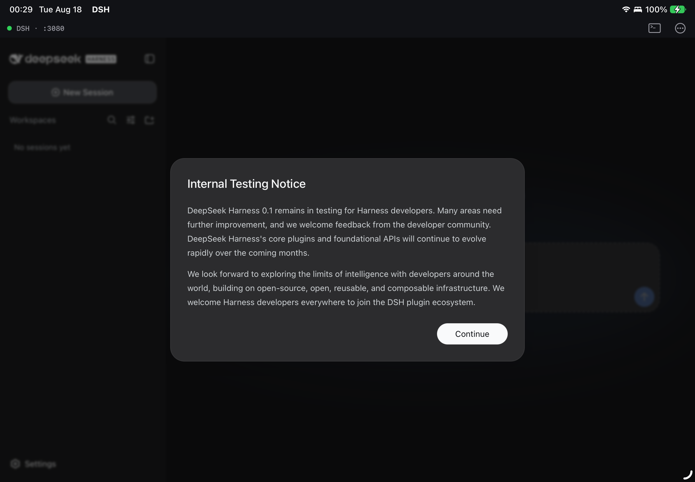

# DSH — DeepSeek Harness on iPad / iPhone

DSH runs [DeepSeek Harness](https://github.com/deepseek-ai/deepseek-harness)
(`dsh`) **entirely on the device, without a jailbreak**. It embeds the
[iSH-ARM64](../ish-arm64) userspace Linux emulator, boots a bundled Alpine
Linux root filesystem with Node.js 22 and `@deepseek-ai/dsh`, supervises
`dsh web`, and shows the harness's own web UI in a `WKWebView`.



## How it works

```
┌─ DSH.app ─────────────────────────────────────────────────────┐
│  DSHRootViewController  ──►  WKWebView  ──►  http://127.0.0.1:3080│
│        │                                            ▲          │
│  DSHHarness (supervisor: port pick, readiness probe,│restart)  │
│        │ ISHShellExecutor                           │          │
│  ┌─────▼──── iSH-ARM64 emulator (Alpine 3.21 aarch64) ┐        │
│  │  /usr/local/bin/dsh-serve  →  node --expose-internals│      │
│  │      @deepseek-ai/dsh web --host 127.0.0.1 --port N ─┘      │
│  └──────────────────────────────────────────────────────┘      │
└───────────────────────────────────────────────────────────────┘
```

* The guest's sockets are pass-through host sockets, so the loopback port
  the guest listens on is reachable from the app's web view.
* `dsh-serve` (in `rootfs/overlay`) is the guest entry point;
  `cordis.patch.yml` is the profile layer that turns off the per-command
  sandbox (the whole guest already is one) and defines the `guest-ask`
  permission preset.
* The rootfs is built **on the Mac inside the same emulator** by
  `scripts/build-rootfs.sh` and shipped as `root.tar.gz` in the app bundle;
  first launch imports it (~30 s), later launches take a few seconds.
* `DSHRootUpgrader` compares the bundled image's SHA-256 with the imported
  root on every launch. An update that ships a new image imports it as a new
  root, boots it, copies `/root/.dsh` (sessions, credentials, settings) and
  `/root/workspace` over from the previous root inside the guest, and deletes
  the old root — so app updates never lose user data.

### Changes made to the emulator (`../ish-arm64`)

| Change | Why |
|---|---|
| `FCVTL/FCVTL2`, `FCVTN/FCVTN2`, `FCVTXN/FCVTXN2` and vector fixed-point `SCVTF/UCVTF/FCVTZS/FCVTZU #fbits` gadgets | libvips (used by `sharp`, dsh's image attachment plugin) traps on them |
| `FMOV (scalar, immediate)` decoder fix | imm8 bit 6 was not inverted for constants like `2.25`, `31.0` — any guest program got wrong values |
| `waitpid()` no longer returns `EINTR` when its 1 s bounded wait merely times out | broke gcc/g++ (`failed to get exit status`), node-gyp, and anything waiting on a child > 1 s |
| New `fetch()` polyfill (`app/RootfsPatch.bundle`) returning real `Response` objects with streaming bodies | LLM streaming (SSE) through undici needs WebAssembly, which jitless V8 lacks |
| `ISHShellExecutor` reports shell exit codes instead of raw wait status and drains the pipes after the process exits (last lines were lost); `ContainerURL()` falls back without an app group; deployment target 15.0 | app integration |

## Building

Prerequisites: Xcode 26/27 on Apple Silicon, `brew install meson ninja`,
Node.js ≥ 20 + npm on the host, the `xcodeproj` Ruby gem (comes with CocoaPods),
an Apple developer team for device signing.

```bash
make emulator     # iSH-ARM64 CLI + fakefsify (used to build/test the rootfs)
make rootfs       # build/root.tar.gz  (~95 MB, ~6 min)
make project      # (re)generates DSH.xcodeproj — only needed after adding/removing files
make run TEAM=XXXXXXXXXX DEVICE=<udid>   # build, sign, install, launch on the iPad
```

Or just open **`DSH.xcodeproj`** in Xcode, pick the **DSH** scheme and your
iPad, set the team (Signing & Capabilities, or `DSH_DEVELOPMENT_TEAM` in
`app/AppDSH.xcconfig`) and Run. The project is generated by
`scripts/gen-xcode-project.rb`: it compiles the iSH-ARM64 emulator sources
straight from `../ish-arm64` (group *ish-arm64* in the navigator), builds the
meson libraries in a script phase, links iSH's `libarchive` subproject, and
bundles `build/root.tar.gz`. Re-run the script when you add source files;
everything else (settings, signing) lives in `app/AppDSH.xcconfig`.

## Tests

```bash
make test          # unattended: emulator, rootfs, unit + UI tests on the simulator
make test-device   # unit + UI tests on the connected iPad (needs UI automation enabled in Settings ▸ Developer)
```

| Suite | What it covers | Where |
|---|---|---|
| `tests/emu-test.sh` | new NEON conversion gadgets + FMOV fix (C test compiled with gcc inside the guest), `waitpid` regression, fetch polyfill (host node) | macOS |
| `tests/rootfs-test.sh` | imports `root.tar.gz` like the app, guest self test (node-pty/koffi/ripgrep/sharp), profile patch, **headless LLM round trip through a mock DeepSeek SSE server**, `dsh-serve` reachable over loopback | macOS |
| `DSHTests` (XCTest, hosted in the app) | port allocator, log ring, readiness probe, harness state machine (fake launcher + local HTTP server); guest integration: real server answers, `dsh-selftest` passes, node/dsh versions | simulator / device |
| `DSHUITests` (XCUITest) | app boots to the DeepSeek Harness UI, port shown in the bar, server log sheet, terminal sheet | simulator / device |

## Using the app

1. Launch; the first start imports the root filesystem and starts the harness
   (about 30 s, shown on the overlay with a live log tail).
2. Tap **Configure later** or paste a DeepSeek API key when the harness asks;
   keys are stored by dsh inside the guest (`/root/.dsh`).
3. Choose the workspace (`/root/workspace` is pre-created) and chat.
4. The bar at the top shows the harness state and port; `>_` opens an
   Alpine shell in the same guest (`apk add …`, `npm i -g …`, inspect
   `~/.dsh`), `⋯` offers Reload, Server Log, Restart, Open in Safari.

Limits: node runs jitless (`--jitless --no-lazy`) under emulation, so heavy
turns are slower than on a Mac; iOS suspends the app in the background, the
harness resumes with the app.

## Layout

```
DSH.xcodeproj  generated Xcode project (DSH, DSHTests, DSHUITests; scheme DSH)
app/        Objective-C sources, xcconfig, Info.plist, assets, launch screen
rootfs/     overlay files baked into the guest image + pinned npm staging manifest
scripts/    build-rootfs.sh, gen-xcode-project.rb
tests/      emu-test.sh, rootfs-test.sh, mock-deepseek.mjs, fetch-polyfill-test.mjs,
            emu/ (guest C tests), DSHTests/, DSHUITests/
build/      generated: root.tar.gz, work dirs, xcresult bundles (git-ignored)
```

## License

GPL-3.0 (the app embeds the GPLv3 iSH emulator; iSH's App Store terms in
`../ish-arm64/LICENSE.IOS` apply too). Details and third-party notices in
[LICENSE.md](LICENSE.md).
